# 🌿 Plant Species Image Classification
### Using Google Teachable Machine — Aloe Species Edition

---

## A. Project Overview

This project presents an image classification model trained to identify **20 distinct Aloe species** using [Google Teachable Machine](https://teachablemachine.withgoogle.com/). Aloe plants belong to the family *Asphodelaceae* and are widely recognized for their ornamental beauty, medicinal properties, and ecological diversity. Despite their shared genus, individual Aloe species differ significantly in leaf shape, color, rosette pattern, size, and texture — making them an ideal and challenging subject for machine learning classification.

### Purpose
The primary goal of this model is to:
- Accurately distinguish between 20 visually similar Aloe species from image input
- Demonstrate how machine learning can be applied to botanical identification
- Provide a foundation for plant recognition tools useful in horticulture, conservation, and education

The model was trained on a dataset of **8,000+ images** across 20 species, covering varied angles, lighting conditions, and growth stages to ensure robust generalization.

---

## B. Plant Species

Below are the 20 Aloe species used in this classification project, each with a representative image and brief description.

---

### 1. Aloe AJR
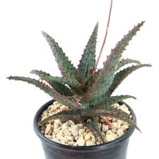

| | |
|---|---|
| **Common Name** | Aloe AJR |
| **Scientific Name** | *Aloe* 'AJR' (Hybrid Cultivar) |

**Description:** Aloe AJR is a compact hybrid cultivar with medium green, white-spotted leaves and serrated edges, making it a popular choice in succulent collections.

---

### 2. Aloe Arborescens
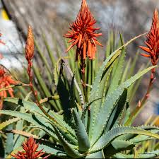

| | |
|---|---|
| **Common Name** | Krantz Aloe / Candelabra Aloe |
| **Scientific Name** | *Aloe arborescens* Mill. |

**Description:** A large, multi-stemmed shrub reaching up to 3 meters tall, Aloe arborescens bears vivid red-orange flowers in winter and is widely used in traditional medicine across South Africa and Japan.

---

### 3. Aloe Aristata
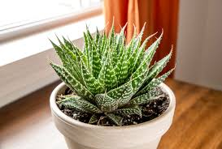

| | |
|---|---|
| **Common Name** | Lace Aloe / Torch Plant |
| **Scientific Name** | *Aloe aristata* Haw. |

**Description:** Aloe aristata is a small, stemless succulent forming dense rosettes of dark green leaves covered in white tubercles and a terminal bristle at the tip, producing orange-red flowers and thriving in cooler climates.

---

### 4. Aloe Blizzard
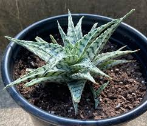

| | |
|---|---|
| **Common Name** | Aloe Blizzard |
| **Scientific Name** | *Aloe* 'Blizzard' (Hybrid Cultivar) |

**Description:** Aloe Blizzard is a hybrid cultivar prized for its neat rosettes of green leaves densely covered in white or cream-colored spots, giving it a distinctive snow-like appearance ideal for containers and rock gardens.

---

### 5. Aloe Blue Boy
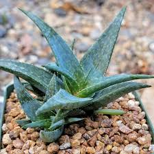

| | |
|---|---|
| **Common Name** | Blue Boy Aloe |
| **Scientific Name** | *Aloe* 'Blue Boy' (Hybrid Cultivar) |

**Description:** Aloe Blue Boy is a hybrid cultivar distinguished by its striking blue-grey to silver-green foliage forming a compact rosette with finely toothed margins, widely used in ornamental landscaping for its unique color and drought tolerance.

---

### 6. Aloe Blue Elf
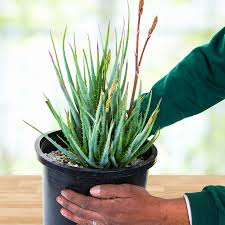

| | |
|---|---|
| **Common Name** | Blue Elf Aloe |
| **Scientific Name** | *Aloe* 'Blue Elf' (Hybrid Cultivar) |

**Description:** Aloe Blue Elf is a compact hybrid with narrow, upright blue-green leaves and orange-toothed margins that produces prolific coral-orange flowers year-round, making it a drought-tolerant favorite in Mediterranean-climate gardens.

---

### 7. Aloe Brevifolia
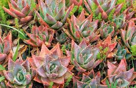

| | |
|---|---|
| **Common Name** | Short-leaved Aloe / Crocodile Aloe |
| **Scientific Name** | *Aloe brevifolia* Mill. |

**Description:** Native to the Western Cape of South Africa, Aloe brevifolia is a small clustering succulent with short, broad, blue-green leaves in tight rosettes that often turn reddish under stress and produce red-orange flowers.

---

### 8. Aloe Broomii
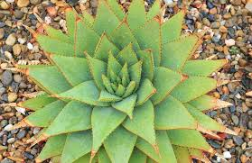

| | |
|---|---|
| **Common Name** | Mountain Aloe / Snake Aloe |
| **Scientific Name** | *Aloe broomii* Schönland |

**Description:** Aloe broomii is a solitary aloe from the rocky mountain slopes of South Africa, recognized by its dense rosette of broad, grayish-green leaves with brown-tipped teeth and a tall, unusual flower spike of pale yellow blooms enclosed in reddish bracts.

---

### 9. Aloe Castillonaie
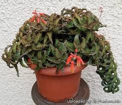

| | |
|---|---|
| **Common Name** | Aloe Castillonaie |
| **Scientific Name** | *Aloe castillonaie* |

**Description:** Aloe castillonaie is a lesser-known, arid-adapted species with rosettes of grey-green serrated leaves, cultivated primarily by succulent enthusiasts for its distinctive form and hardiness.

---

### 10. Aloe Dial Lights
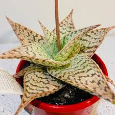

| | |
|---|---|
| **Common Name** | Dial Lights Aloe |
| **Scientific Name** | *Aloe* 'Dial Lights' (Hybrid Cultivar) |

**Description:** Aloe Dial Lights is a vibrant hybrid cultivar whose leaves shift through shades of red, orange, and green depending on sun exposure, making it a striking drought-tolerant ornamental for gardens and containers.

---

### 11. Aloe Jurassic Dino
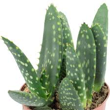

| | |
|---|---|
| **Common Name** | Jurassic Dino Aloe |
| **Scientific Name** | *Aloe* 'Jurassic Dino' (Hybrid Cultivar) |

**Description:** Aloe Jurassic Dino is a bold hybrid cultivar with thick, rugged leaves featuring prominent ridges, bumps, and contrasting colors that give it a prehistoric, dinosaur-like appearance popular among collectors.

---

### 12. Aloe Krakatoa
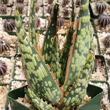

| | |
|---|---|
| **Common Name** | Krakatoa Aloe |
| **Scientific Name** | *Aloe* 'Krakatoa' (Hybrid Cultivar) |

**Description:** Named after the famous Indonesian volcano, Aloe Krakatoa is a compact hybrid cultivar with intensely red-orange leaves and fiery flower spikes that deepen in color with bright sunlight, ideal for low-water landscaping.

---

### 13. Aloe Krohniana
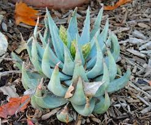

| | |
|---|---|
| **Common Name** | Aloe Krohniana |
| **Scientific Name** | *Aloe krohniana* |

**Description:** Aloe krohniana is a rare collector's species prized for its intricate patterns of spots or stripes on each leaf, making every individual plant visually unique.

---

### 14. Aloe Nobilis
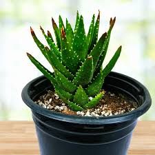

| | |
|---|---|
| **Common Name** | Gold-tooth Aloe / Noble Aloe |
| **Scientific Name** | *Aloe nobilis* Haw. |

**Description:** Aloe nobilis is a clustering succulent from South Africa with narrow, dark green leaves edged in distinctive yellow-white teeth and orange-red flowers, making it one of the most popular and hardy garden aloes worldwide.

---

### 15. Aloe Peckii
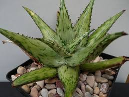

| | |
|---|---|
| **Common Name** | Peck's Aloe |
| **Scientific Name** | *Aloe peckii* Bally & Verdoorn |

**Description:** Native to Somalia, Aloe peckii features deep green leaves with white spots in irregular rows, reddish-brown marginal teeth, and scarlet to orange-red tubular flowers, making it a prized plant among collectors.

---

### 16. Aloe Perfoliata
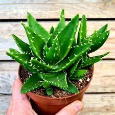

| | |
|---|---|
| **Common Name** | Mitre Aloe / Rubble Aloe |
| **Scientific Name** | *Aloe perfoliata* L. |

**Description:** Aloe perfoliata is a compact clustering aloe from the Western Cape of South Africa, notable for its blue-green leaves that clasp around the stem and its bright orange-red flowers, adapting well to poor, rocky soils.

---

### 17. Aloe Polyphylla
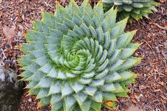

| | |
|---|---|
| **Common Name** | Spiral Aloe / Lesotho Aloe |
| **Scientific Name** | *Aloe polyphylla* Schönland ex Pillans |

**Description:** Aloe polyphylla, endemic to the mountain grasslands of Lesotho, is one of the world's most iconic succulents, instantly recognizable by its perfectly symmetrical spiral rosette of up to 150 grey-green leaves arranged in 5 distinct rows.

---

### 18. Aloe Karasbergensis
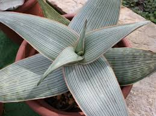

| | |
|---|---|
| **Common Name** | Karasberg Aloe |
| **Scientific Name** | *Aloe karasbergensis* Pillans |

**Description:** Aloe karasbergensis is a medium-sized clustering aloe from the arid mountains of Namibia and South Africa, featuring greyish spotted leaves with brownish teeth and orange to yellow-orange flowers suited to desert landscaping.

---

### 19. Aloe Maculata
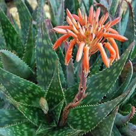

| | |
|---|---|
| **Common Name** | Soap Aloe / Zebra Aloe |
| **Scientific Name** | *Aloe maculata* All. |

**Description:** Aloe maculata is a widespread South African species forming broad, flat rosettes of green leaves heavily marked with white spots whose sap lathers with water — earning it the name "Soap Aloe" — and producing bicolored orange and yellow-green flowers.

---

### 20. Aloe Marlothii
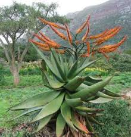

| | |
|---|---|
| **Common Name** | Mountain Aloe / Flat-flowered Aloe |
| **Scientific Name** | *Aloe marlothii* A.Berger |

**Description:** Aloe marlothii is one of the largest aloes, a single-stemmed tree reaching up to 6 meters tall with enormous grey-green leaves covered in reddish-brown spines on both surfaces and horizontally branching flower stalks that serve as a vital winter food source for wildlife.

---

## C. Model Training Details

The model was trained using **Google Teachable Machine** with the following configuration:

| Parameter | Value |
|---|---|
| **Epochs** | 100 |
| **Batch Size** | 16 |
| **Learning Rate** | 0.001 |
| **Number of Classes** | 20 |

### Why These Values?

**Epochs (100):** 100 epochs were used to allow the model sufficient training cycles to distinguish the subtle visual differences across 20 Aloe species. As seen in the accuracy-per-epoch graph, the training accuracy stabilized near 1.0 well before 100 epochs, confirming the model converged properly without significant overfitting.

**Batch Size (16):** A batch size of 16 was selected to balance training stability and memory efficiency. Smaller batches provide more frequent weight updates per epoch, which helps the model learn fine-grained differences between visually similar species such as Aloe Blue Boy and Aloe Blue Elf.

**Learning Rate (0.001):** The default learning rate of 0.001 was retained as it is well-suited for image classification tasks on this scale. It allowed smooth and consistent convergence without the risk of overshooting optimal weight values.

### Training Settings Screenshot

---

## D. Model Evaluation

After training, the **"Under the Hood"** section of Teachable Machine was used to evaluate model performance across all 20 Aloe species classes.

### Confusion Matrix

The confusion matrix below shows predicted vs. actual classifications across all 20 species. The strong diagonal indicates high correct prediction rates, with the most notable confusion occurring between Aloe Blue Boy and Aloe Blue Elf due to their visual similarity.

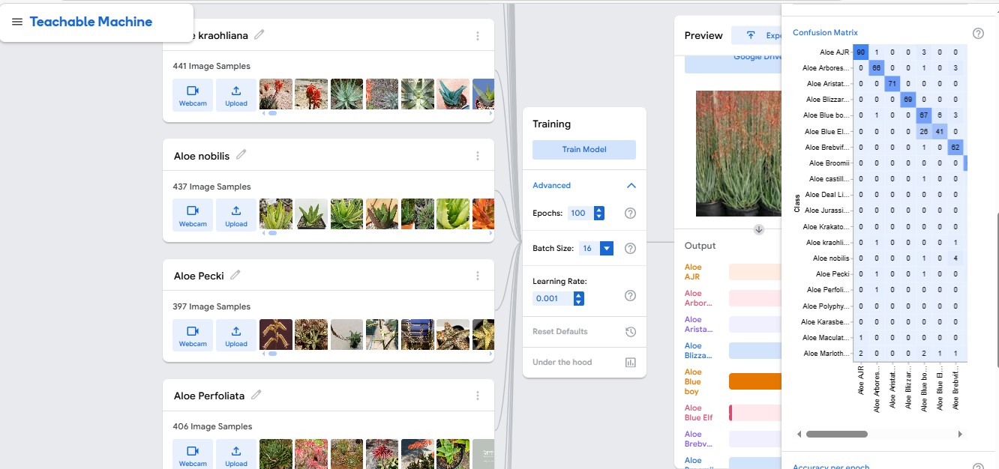

### Accuracy per Epoch & Loss per Epoch

The graphs below show how training accuracy and loss evolved over 100 epochs. Training accuracy (blue) quickly approached 1.0, while test accuracy (orange) stabilized around 0.9, indicating good generalization. The loss per epoch graph shows training loss (blue) converging near 0 while test loss (orange) remained slightly higher, which is expected behavior.

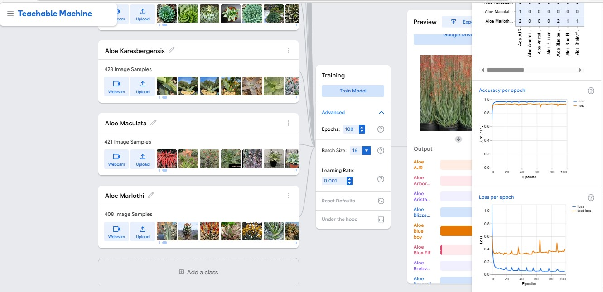

### Accuracy Per Class

| # | Species | Accuracy | # Samples |
|---|---|---|---|
| 1 | Aloe AJR | 0.93 | 97 |
| 2 | Aloe Arborescens | 0.93 | 71 |
| 3 | Aloe Aristata | 1.00 | 71 |
| 4 | Aloe Blizzard | 1.00 | 69 |
| 5 | Aloe Blue Boy | 0.83 | 81 |
| 6 | Aloe Blue Elf | 0.61 | 67 |
| 7 | Aloe Brebvifolia | 0.91 | 68 |
| 8 | Aloe Broomii | 1.00 | 65 |
| 9 | Aloe Castillonaie | 0.95 | 62 |
| 10 | Aloe Deal Lights | 0.98 | 63 |
| 11 | Aloe Jurassic Dino | 0.98 | 57 |
| 12 | Aloe Krakatoa | 1.00 | 56 |
| 13 | Aloe Kraohliana | 0.96 | 67 |
| 14 | Aloe Nobilis | 0.88 | 66 |
| 15 | Aloe Pecki | 0.93 | 60 |
| 16 | Aloe Perfoliata | 0.98 | 61 |
| 17 | Aloe Polyphylla | 0.96 | 47 |
| 18 | Aloe Karasbergensis | 0.95 | 64 |
| 19 | Aloe Maculata | 0.86 | 64 |
| 20 | Aloe Marlothi | 0.82 | 62 |

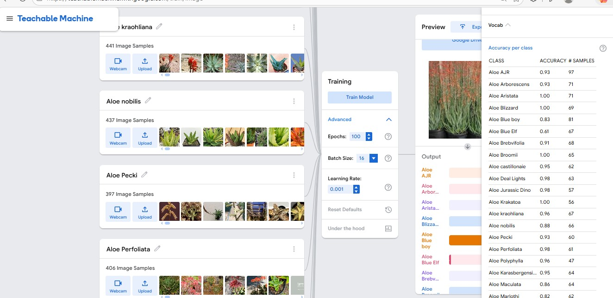

---

## E. Model Testing

The trained model was tested using the **Preview** section of Google Teachable Machine. A total of 10 tests were conducted. Each test includes 3 screenshots: the main preview screen, and two additional parts showing the input image and confidence score in detail.

---

### Test 1 — Aloe AJR

| | |
|---|---|
| **Input Image** | Aloe AJR |
| **Predicted Class** | Aloe AJR |
| **Confidence Score** | — |

---

### Test 2 — Aloe Arborescens

| | |
|---|---|
| **Input Image** | Aloe Arborescens |
| **Predicted Class** | Aloe Arborescens |
| **Confidence Score** | — |

---

### Test 3 — Aloe Aristata

| | |
|---|---|
| **Input Image** | Aloe Aristata |
| **Predicted Class** | Aloe Aristata |
| **Confidence Score** | — |

---

### Test 4 — Aloe Blizzard

| | |
|---|---|
| **Input Image** | Aloe Blizzard |
| **Predicted Class** | Aloe Blizzard |
| **Confidence Score** | — |

---

### Test 5 — Aloe Blue Boy

| | |
|---|---|
| **Input Image** | Aloe Blue Boy |
| **Predicted Class** | Aloe Blue Boy |
| **Confidence Score** | — |

---

### Test 6 — Aloe Blue Elf

| | |
|---|---|
| **Input Image** | Aloe Blue Elf |
| **Predicted Class** | Aloe Blue Elf |
| **Confidence Score** | — |

---

### Test 7 — Aloe Broomii

| | |
|---|---|
| **Input Image** | Aloe Broomii |
| **Predicted Class** | Aloe Broomii |
| **Confidence Score** | — |

---

### Test 8 — Aloe Polyphylla

| | |
|---|---|
| **Input Image** | Aloe Polyphylla |
| **Predicted Class** | Aloe Polyphylla |
| **Confidence Score** | — |

---

### Test 9 — Aloe Nobilis

| | |
|---|---|
| **Input Image** | Aloe Nobilis |
| **Predicted Class** | Aloe Nobilis |
| **Confidence Score** | — |

---

### Test 10 — Aloe Marlothii

| | |
|---|---|
| **Input Image** | Aloe Marlothii |
| **Predicted Class** | Aloe Marlothii |
| **Confidence Score** | — |

---

## Reflection Questions

**1. How did the number of images per class affect your model's accuracy?**
Classes with more image samples tended to achieve higher accuracy. Species like Aloe Aristata, Aloe Blizzard, Aloe Broomii, and Aloe Krakatoa all reached 1.00 accuracy, while Aloe Blue Elf scored the lowest at 0.61 — likely due to fewer samples and strong visual resemblance to Aloe Blue Boy.

**2. Which plant species were most commonly misclassified and why?**
Aloe Blue Elf (0.61) and Aloe Blue Boy (0.83) were most commonly confused with each other, as both share similar blue-green leaf coloring and compact rosette forms. Aloe Marlothi (0.82) and Aloe Maculata (0.86) also showed lower accuracy, possibly due to overlapping leaf patterns across samples.

**3. How did changing the epochs, batch size, or learning rate affect the training results?**
Using 100 epochs allowed the model to converge fully, as shown by the accuracy-per-epoch graph stabilizing near 1.0 around epoch 20–30. The batch size of 16 enabled frequent weight updates which helped the model learn fine distinctions between similar species. The learning rate of 0.001 provided steady, stable convergence without oscillation.

**4. What challenges did you encounter during dataset collection and labeling?**
The main challenges were sourcing sufficient high-quality images for rarer hybrid cultivars and ensuring consistent labeling for visually similar species. Some species like Aloe Blue Elf and Aloe Blue Boy required extra care during labeling to avoid cross-contamination of classes.

**5. If you were to improve your model, what specific changes would you make and why?**
Increasing the number of images for underperforming classes — particularly Aloe Blue Elf — would be the most impactful improvement. Applying data augmentation techniques such as flipping, rotation, and brightness variation could also help the model generalize better, especially for species with limited dataset variety.
